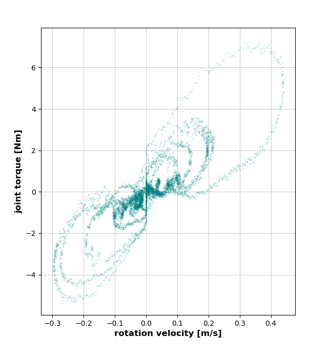
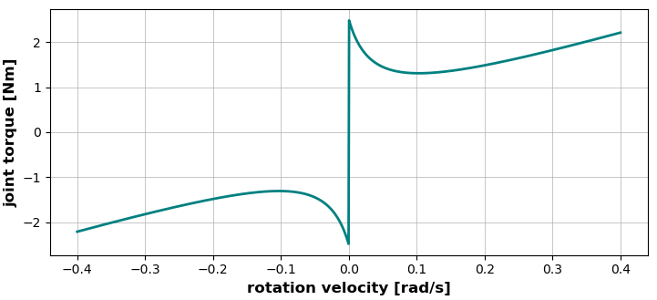
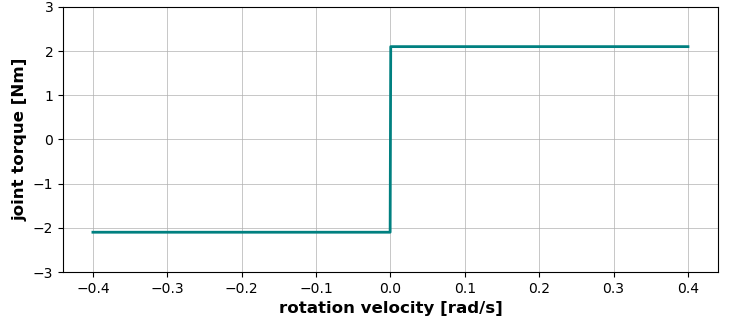
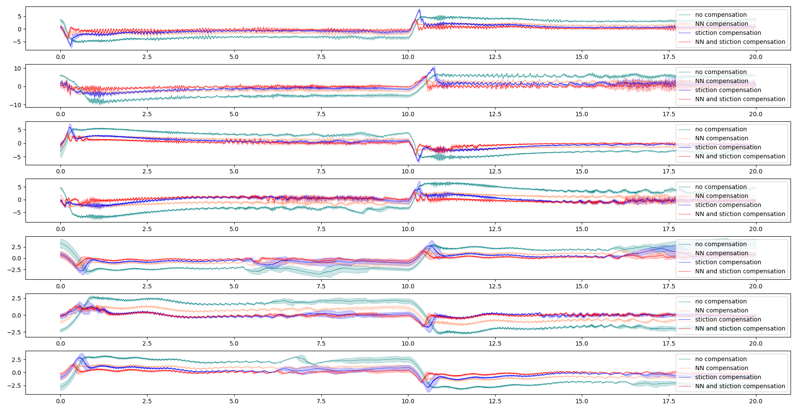

# Machine learning for torque error tracking


## Overview

Accurate torque tracking is critical in several applications of robotics: a precise torque control enables controling the mechanical actions of the robots on its environment. Due to mechanical friction and magnetic effects in the actuator's rotor, achieving perfect torque tracking is tricky.

Friction is especially challenging due to its discontinuous nature. In addition, non-linear behaviours, couplings and thermic effects render analytical model unsufficient when dealing with robots.

The aim of this work is to use neural network (NN) to estimate more accurately the torque error in such scenarios. 



## Training a LSTM estimator

* `simulation.py`: Runs the mujoco simulation for a given number of timesteps and outputs the dataset of the state, desired state, joint friction of the robot  at each timestep.
* `net.py`: Architecture of the LSTM model.
* `train.py`: Main code for training the LSTM model on the dataset
* `data_loader.py`: conversion between pandas dataset to sequences of torch tensors.
* `torch_script_export.py` converts a torch model in a libtorch script for using with mc-rtc controller

To run the simulation with a graphical interface:
```
python3 simulation.py --path path/to/robot.xml
```

In order to train a neural network model for 100 epochs:
```
python3 train.py --outdir path/to/output_folder --xml path/to/robot.xml --epochs 100 
```
This script will first run the simulation, store the training and validation datasets and train the net model for the desired number of epochs. Beware that the dimensions of the tensors have to be consistent between `train.py` and `data_loader.py` scripts. The optional hyperparameters are:

* `--model path/to/trained.model` path to saved weight dictionaries for retraining a model (default `None`)
* `--checkpoint 10` the model is saved every 10 epochs (default 50)
* `--sequence` change sequence length
* `--rate` change learning rate 
* `--tol` change threshold on valid loss improvement
* `--train_steps` change size of training dataset
* `--valid_steps` change size of validation dataset

Once the model is trained, it has to be converted to libtorch script in order to be used in a controller:
```
python3 torch_script_export.py -o path/to/out_folder -m path/to/trained.model --sequence 10 --layers 2 --input 28 --output 7 --hidden 32
```

## Analytical model

Analytical models provide reliable means to overcome the stiction phenomenon. Analytical models can implement discontinuities and heir behaviour is fully known. However, analytical models alone offer poor quality of estimation.


The Stribeck model is used to train the NN model in simulation:

$$
\Delta\tau = (F_s - F_c)\exp\left(-\left|\frac{\alpha}{\alpha_s}\right|\right)\text{sign}(\alpha) + F_c \text{sign}(\alpha) + D\alpha
$$

* $\Delta \tau$ is the friction torque.
* $F_s$ is the stiction torque which needs to be overcome to begin relative movement
* $F_c$ is the minimal torque which would theorically be necessary to continue movement once stiction has been overcome
* $\alpha_s$ is the velocity corresponding to a torque of $F_c$
* $D$  is the viscosity coefficient dictating fluid friction at higher velocity.


The following simple model can be used to overcome stiction. The idea is to always output enough current in the actuator so that the joint is never motionless due to friction. The joint can only stop if the torque dedicated to the movement $(\tau_d-c)$ is small enough. Let $\epsilon$ be a positive real number.

$$
\left\{ \begin{array}{cc}
0 &\quad \text{if } |\tau_d - c|<\epsilon \\
\text{sign}(\tau_d - c) F_s &\quad \text{if } |\alpha|<\epsilon  \\
 \text{sign}(\alpha) F_s &\quad \text{otherwise }
\end{array} \right.
$$



#### Proof for small velocity

Let us consider the first order truncature of the Taylor serie of the velocity for any $dt$:

$$
\alpha(t+dt) = \alpha(t) + dt \frac{d\alpha}{dt} + o(dt^2)
$$

it follows that if $\alpha(t) \ll 1$, the sign of the velocity will be dictated by the sign of the acceleration. The sign of desired acceleration is estimated from the desired torque using inverse dynamics. 

## Evaluating the NN model

The *mc-rtc* controller `KinovaReal` allows to control the real robot with the NN driven compensation using the torch C++ API LibTorch. The  LibTorch ZIP archive can be donloaded at the link below (chose the most recent CUDA version and **the cxx11 ABI version**)

https://pytorch.org/get-started/locally/

In order to build the controller, the absolute path to the LibTorch Zip has to be inputed:

```
mkdir build
cd build
cmake -DCMAKE_PREFIX_PATH=/absolute/path/to/libtorch ..
cmake --build . --config Release
```

The controller works using the kortex API. If *mc_kortex* is correctly installed, `KinovaReal` is enabled in the `mc-rtc.yaml` configuration file and the connection to the robot is correctly configured, then the controller can be executed from command

```
roslaunch mc_rtc_ticker display.launch
mc_kortex
```

Which uses *mc-rtc-ticker* gui to access the online plots and online control of the robot. The compensation using analytical model and NN model can be enabled from the `compensation` tab by clicking the respective button once. 


## Main results

The following figure shows the evolution of error with the different compensations during back and forths between two postures. Each plot is averaged on ten trajectories. 



The combination of LSTM compensation and analytical model of stiction is the most accurate method.

## Further improvements

* The analytical model can be replaced by a more accurate version like the Stribeck model.
* An even better solution would consist in having an online identification of the coefficient of the coefficients using another neural network.
* This project comprises codes to train a RL agent on the simulation using stable baseline 3 PPO or recurrent PPO. This could replace the analatycal model on the condition of having a very simple action space: for example a discrete action space with 3 actions 
    1. send $F_s$
    2. send $-F_s$
    3. send $0$